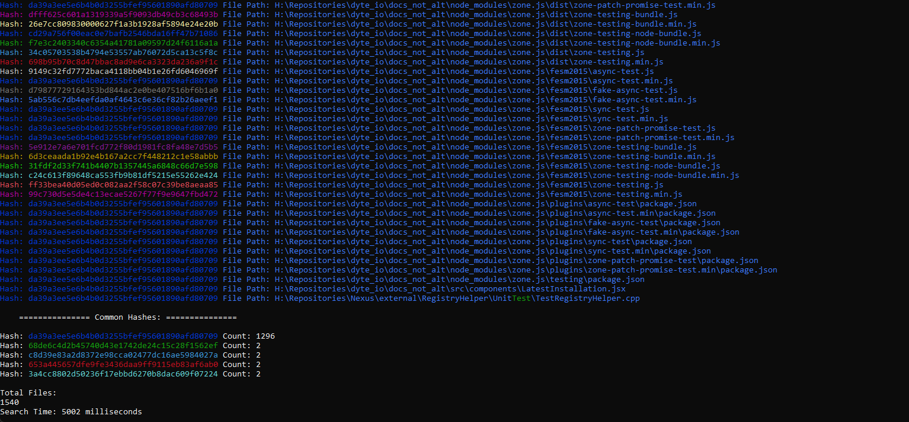

# Windows File Indexer

File Indexer is a simple command-line utility that allows you to index files on your drives, search for filenames, and search for files based on their hash values.

## Features

- Index specific drives or all available drives.
- Search for filenames and display matching files with hash information.
- Search for files based on their hash values.
- Provides a summary of common hashes found during a search.

## Getting Started

### Prerequisites

- Windows operating system.
- C++ compiler that supports C++11 (e.g., Visual Studio).

### Building from Source

1. Clone the repository:

    ```bash
    git clone https://github.com/Arteiii/WindowsFileIndexing.git
    cd WindowsFileIndexing
    ```

2. Open the project in your preferred C++ development environment.

3. Build the project.

4. Run the compiled executable.

## Usage

- Run the compiled executable and follow the on-screen instructions to index drives or search for files.



## Release

Visit the [GitHub Releases](https://github.com/Arteiii/WindowsFileIndexing/releases) page to download precompiled binaries for Windows.

## License

This project is licensed under the [Apache License 2.0](https://opensource.org/license/apache-2-0/) - see the [LICENSE](LICENSE) file for details.
